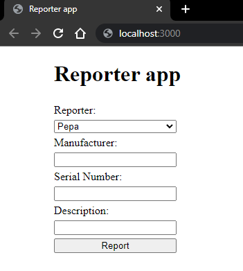
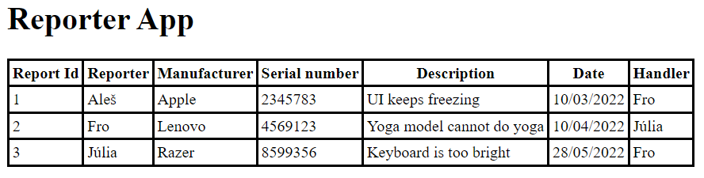

# Green Fox Notebook Error Reporter

Build a web application that people can use to report technical issues.

## Highlights

People can use a form to submit a new error report. This report is then saved to the database and added to the frontend table for others to see. Users can create as many reports as they want, but each user can only handle a maximum of 5 reports assigned to them at any time.

## Database

It is up to you to define what the database model will look like, it just needs to help the backend fulfill the outlined functionality.

Only requirements are:

- all users and reports need to be stored in the database
- users and reports will be stored in separate tables
- there must be some relationship between these tables

## Main page



- the **frontend** should have

    - a heading with the title of the site

    - form to register an error

        - drop-down list with all name options to assign a reporter
        - input field to set the manufacturer
        - input field to set the serial number
        - input field to set the description
        - a REPORT button which sends the form

## Backend

The backend should

- validate incoming data (there should be no exceptions coming from incorrect inputs)
- perform database calls
- make sure every handler has a maximum of 5 reports

## Endpoints

### GET `/`

- This endpoint should render an HTML displaying the report form (showed above)
- The user names list should come from the database based on the existing user names. This list should not contain duplications.
- In case of error it should display a received error message beneath the form

### GET `/list`

This endpoint should render an HTML displaying the full list of reports


### POST `/report`

This endpoint should

- receive all the information from the form about the report
- supplement the issue with the actual date
- save the issue into database if the inputs are valid
- randomly assign a handler to the report, which must be different from the reporter.
- redirect to `GET /list` to see newly added report
- redirect to `GET /` if data validation fails and supply the endpoint with an error message: `validation failed`

### DELETE `/complete/{id}`

- This endpoint should delete the specified report if the request's body contains
```json
{
    "secret" : "voala"
}
```
- If item is not found send HTTP 404
- If the "secret" is not part of the request then send HTTP 400
- If the "secret" is not voala then send HTTP 403

### GET `/api/reports`

This endpoint should return all the tickets which has matching either
`manufacturer`, `reporter`, or `handler`.

Example query:

`http://localhost:8080/api/reports?manufacturer=Apple`

- this should return a JSON with every report where the manufacturer is "Apple"

```json
{
    "result": "ok",
    "reports":
    [
        {
            "id" : "21",
            "reporter" : "Egg",
            "handler" : "Szilvi",
            "manufacturer" : "Apple",
            "serialNumber" : "123456789",
            "description" : "screen pixel error",
            "date" : "2018.01.10"
        },
        {
            "id" : "27",
            "reporter" : "Szilvi",
            "handler" : "Peter",
            "manufacturer" : "Apple",
            "serialNumber" : "987654321",
            "description" : "touchpad not working",
            "date" : "2018.01.17"
        }
    ]
}
```

`http://localhost:8080/api/reports?reporter=Egg`

- this should return a JSON with every report where the reporter is "Egg"
- if no result:

```json
{
    "result": "ok",
    "tickets": []
}
```

## Question

Given the following table named `applicants`.

| id | name               | country_id | age |
|:---|:-------------------|:-----------|:----|
| 1  | Bořivoj Souček     | 1          | 24  |
| 2  | Papp Patrícia      | 2          | 33  |
| 3  | Kocsis Ivett       | 2          | 37  |
| 4  | Slavomír Vykukal   | 1          | 20  |
| 5  | Bruno Malík        | 1          | 31  |
| 6  | Veronika Lukešová  | 1          | 18  |
| 7  | Székely Miklós     | 2          | 29  |
| 8  | Hegedüs Benjámin   | 2          | 37  |
| 9  | Nela Machová       | 1          | 20  |
| 10 | Balog Rajmund      | 2          | 39  |
| 11 | Major Borbála      | 2          | 35  |
| 12 | Evelína Horváthová | 1          | 23  |
| 13 | Vászoly Vivien     | 2          | 40  |
| 14 | Lada Stýskalová    | 1          | 27  |
| 15 | Dagmar Benešová    | 1          | 33  |

Given the following table named `countries`.

| id | country        |
|:---|:---------------|
| 1  | Czech Republic |
| 2  | Hungary        |

Write an SQL query to select the name and the country of applicants from
Hungary with the age over 40.

(BONUS) Write an SQL query to find an average age of all the applicants from Hungary.
